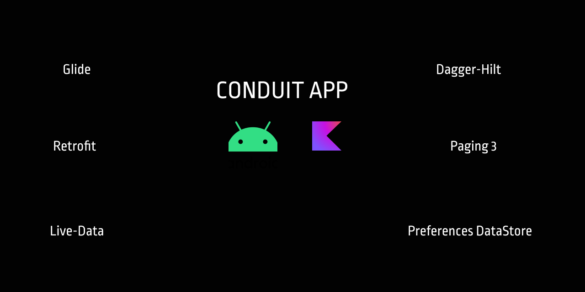

   

# CONDUIT

A article writing app like Medium made with **kotlin** and [**Realworld API**](https://github.com/gothinkster/realworld) using  [**MVVM**](https://developer.android.com/jetpack/guide#overview) architecture.

# TO RUN THIS

1. Clone the repository.
2. Open in Android Studio.

# FEATURES
1. Support login and Signup.
2. Create Article.
3. Read Article.
4. Like Article.

# Built With 🛠
- [Kotlin](https://kotlinlang.org/) - First class and official programming language for Android development.
- [Coroutines](https://kotlinlang.org/docs/reference/coroutines-overview.html) - For asynchronous and more..
- [Android Architecture Components](https://developer.android.com/topic/libraries/architecture) - Collection of libraries that help you design robust, testable, and maintainable apps.
  - [LiveData](https://developer.android.com/topic/libraries/architecture/livedata) - Data objects that notify views when the underlying database changes.
  - [ViewModel](https://developer.android.com/topic/libraries/architecture/viewmodel) - Stores UI-related data that isn't destroyed on UI changes.
  - [ViewBinding](https://developer.android.com/topic/libraries/view-binding) - Generates a binding class for each XML layout file present in that module and allows you to more easily write code that interacts with views.

- [Dependency Injection](https://developer.android.com/training/dependency-injection)
  - [Hilt-Dagger](https://dagger.dev/hilt/) - Standard library to incorporate Dagger dependency injection into an Android application.
  - [Hilt-ViewModel](https://developer.android.com/training/dependency-injection/hilt-jetpack) - DI for injecting `ViewModel`.
- [Material Components for Android](https://github.com/material-components/material-components-android) - Modular and customizable Material Design UI components for Android.
- [Retorfit](https://square.github.io/retrofit/) - A type-safe HTTP client for Android and Java.
- [Gson](https://github.com/google/gson) - A Java serialization/deserialization library to convert Java Objects into JSON and back.
- [Glide](https://github.com/bumptech/glide) - An image loading and caching library for Android focused on smooth scrolling.
- [Preferences dataStore](https://developer.android.com/topic/libraries/architecture/datastore) - DataStore is a data storage solution that allows you to store key-value pairs or typed objects with protocol buffers. 
- [Paging 3](https://developer.android.com/topic/libraries/architecture/paging/v3-overview) - The Paging library helps you load and display pages of data from a larger dataset from local storage or over network. 

# Package Structure

    # Root Package
    
    ├── adapters            # Containe Retorfit adapters
    ├── data                # Data Classes
    ├── api                 # Api's
    ├── di                  # Dependency Injection
    ├── ui                  # Activity/View layer
    ├── repositories        # Single source of data
    └── others              # Utility Classes / Kotlin extensions

## Architecture
This app uses [***MVVM (Model View View-Model)***](https://developer.android.com/jetpack/docs/guide#recommended-app-arch) architecture.

